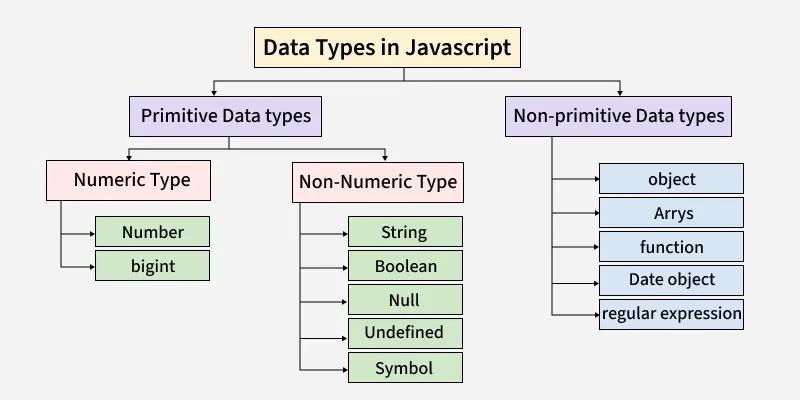

*Q1. What are the data types in JavaScript?*

JavaScript data types define what kind of values a variable can hold and how those values behave in a program. They determine how data is stored in memory and how operations like comparison, calculation, and conversion work.

- Each data type has its own methods and operations that control how it can be used.
- Understanding data types helps prevent errors and makes code more efficient and reliable.

JavaScript Data Type Categories
JavaScript data types are categorized into Primitive and Non-Primitive types

Primitive Data Type
Primitive data types in JavaScript represent simple, immutable values stored directly in memory, ensuring efficiency in both memory usage and performance.

1. Number
The Number data type in JavaScript includes both integers and floating-point numbers. Special values like Infinity, -Infinity, and NaN represent infinite values and computational errors, respectively.

2. String
A String in JavaScript is a series of characters that are surrounded by quotes.

3. Boolean
The boolean type has only two values i.e. true and false.

4. Null
The special null value does not belong to any of the default data types. It forms a separate type of its own which contains only the null value.

5. Undefined
A variable that has been declared but not initialized with a value is automatically assigned the undefined value. It means the variable exists, but it has no value assigned to it.

6. Symbol (Introduced in ES6)
Symbols, introduced in ES6, are unique and immutable primitive values used as identifiers for object properties. They help create unique keys in objects, preventing conflicts with other properties.

7. BigInt (Introduced in ES2020)
BigInt is a built-in object that provides a way to represent whole numbers greater than 253. The largest number that JavaScript can reliably represent with the Number primitive is 253, which is represented by the MAX_SAFE_INTEGER constant.

Non-Primitive Data Types
The data types that are derived from primitive data types are known as non-primitive data types. It is also known as derived data types or reference data types.

1. Object
JavaScript objects are key-value pairs used to store data, created with {} or the new keyword. They are fundamental as nearly everything in JavaScript is an object.

2. Arrays
An Array is a special kind of object used to store an ordered collection of values, which can be of any data type.

3. Function
A function in JavaScript is a block of reusable code designed to perform a specific task when called.

4. Date Object
The Date object in JavaScript is used to work with dates and times, allowing for date creation, manipulation, and formatting.

5. Regular Expression
A RegExp (Regular Expression) in JavaScript is an object used to define search patterns for matching text in strings

Interesting Facts about Data Types

1. Dynamically Typed : JavaScript Variables are not bound to a specific data type. Mainly data type is stored with value (not with variable name) and is decided & checked at run time.

2. Everything is an Object (Sort of): In JavaScript, Functions are objects, arrays are objects, and even primitive values can behave like objects temporarily when you try to access properties on them.

3.  NaN is not equal to itself: NaN Stands for “Not-a-Number”, It is used to represent a computational error. NaN is technically of type number.

4. A Symbol is Never Equal to Another One : Symbol is a unique and immutable data type often used for creating private properties and methods. Symbols are never equal to any other Symbol.

5. Undefined and Null: undefined represents a variable that has been declared but not assigned, while null is an explicit assignment representing “no value”.

6. Integers are Floating are Numbers only. There is only one type number that covers both integers and floating point numbers.

7. A character is also a string. There is no separate type for characters. A single character is also a string.

*Q2. What is the difference between var, let, and const?*

1. Var

Before the advent of ES6, var declarations ruled. There are issues associated with variables declared with var, though. That is why it was necessary for new ways to declare variables to emerge. First, let's get to understand var more before we discuss those issues.

# Scope of var

Scope essentially means where these variables are available for use. var declarations are globally scoped or function/locally scoped. The scope is global when a var variable is declared outside a function. This means that any variable that is declared with var outside a function block is available for use in the whole window. var is function scoped when it is declared within a function. This means that it is available and can be accessed only within that function.

To understand further, look at the example below.

var greeter = "hey hi";

function newFunction() {
   var hello = "hello";
}

Here, greeter is globally scoped because it exists outside a function while hello is function scoped. So we cannot access the variable hello outside of a function.

# Hoisting of var

Hoisting is a JavaScript mechanism where variables and function declarations are moved to the top of their scope before code execution. So var variables are hoisted to the top of their scope and initialized with a value of undefined.

This means that if we do this:

console.log (greeter);
var greeter = "say hello"

it is interpreted as this:

var greeter;
console.log(greeter); // greeter is undefined
greeter = "say hello"

2. Let

let is now preferred for variable declaration. It's no surprise as it comes as an improvement to var declarations.

# let is block scoped

- A block is a chunk of code bounded by {}. A block lives in curly braces. Anything within curly braces is a block. So a variable declared in a block with let is only available for use within that block.

# let can be updated but not re-declared.

Just like var, a variable declared with let can be updated within its scope. Unlike var, a let variable cannot be re-declared within its scope. So while this will work:

let greeting = "say Hi";
greeting = "say Hello instead";

this will return an error:

let greeting = "say Hi";
let greeting = "say Hello instead"; // error: Identifier 'greeting' has already been declared

However, if the same variable is defined in different scopes, there will be no error:

let greeting = "say Hi";
if (true) {
    let greeting = "say Hello instead";
    console.log(greeting); // "say Hello instead"
}
console.log(greeting); // "say Hi"

Why is there no error? This is because both instances are treated as different variables since they have different scopes. This fact makes let a better choice than var. When using let, you don't have to bother if you have used a name for a variable before as a variable exists only within its scope. Also, since a variable cannot be declared more than once within a scope, then the problem discussed earlier that occurs with var does not happen.

# Hoisting of let

Just like var, let declarations are hoisted to the top. Unlike var which is initialized as undefined, the let keyword is not initialized. So if you try to use a let variable before declaration, you'll get a Reference Error.

3. Const

Variables declared with the const maintain constant values. const declarations share some similarities with let declarations.

# const declarations are block scoped

Like let declarations, const declarations can only be accessed within the block they were declared.

# const cannot be updated or re-declared

This means that the value of a variable declared with const remains the same within its scope. It cannot be updated or re-declared. So if we declare a variable with const, we can neither do this:

const greeting = "say Hi";
greeting = "say Hello instead"; // error: Assignment to constant variable.

nor this:

const greeting = "say Hi";
const greeting = "say Hello instead";// error: Identifier 'greeting' has already been declared

Every const declaration, therefore, must be initialized at the time of declaration. This behavior is somehow different when it comes to objects declared with const. While a const object cannot be updated, the properties of this objects can be updated. Therefore, if we declare a const object as this: 

const greeting = {
     message: "say Hi",
     times: 4
}

while we cannot do this:

greeting = {
    words: "Hello",
    number: "five"
} // error:  Assignment to constant variable.

we can do this:   greeting.message = "say Hello instead";

This will update the value of greeting.message without returning errors.

# Hoisting of const
Just like let, const declarations are hoisted to the top but are not initialized.

*Q3. What is the Execution Context?*

When the JavaScript engine scans a script file, it makes an environment called the Execution Context that handles the entire transformation and execution of the code.

During the context runtime, the parser parses the source code and allocates memory for the variables and functions. The source code is generated and gets executed.

There are two types of execution contexts: global and function. The global execution context is created when a JavaScript script first starts to run, and it represents the global scope in JavaScript. A function execution context is created whenever a function is called, representing the function's local scope.

Phases of the JavaScript Execution Context
There are two phases of JavaScript execution context:

1. Creation phase: In this phase, the JavaScript engine creates the execution context and sets up the script's environment. It determines the values of variables and functions and sets up the scope chain for the execution context.

2. Execution phase: In this phase, the JavaScript engine executes the code in the execution context. It processes any statements or expressions in the script and evaluates any function calls.

Everything in JS happens inside this execution context. It is divided into two components. One is memory and the other is code. It is
important to remember that these phases and components are applicable to both global and functional execution contexts.

*Q4. What is the Call Stack?*

To keep the track of all the contexts, including global and functional, the JavaScript engine uses a call stack. A call stack is also known as an 'Execution Context Stack', 'Runtime Stack', or 'Machine Stack'.

It uses the LIFO principle (Last-In-First-Out). When the engine first starts executing the script, it creates a global context and pushes it on the stack. Whenever a function is invoked, similarly, the JS engine creates a function stack context for the function and pushes it to the top of the call stack and starts executing it.

When execution of the current function is complete, then the JavaScript engine will automatically remove the context from the call stack and it goes back to its parent.

Let's see the following example:

function funcA(m,n) {
    return m * n;
}

function funcB(m,n) {
    return funcA(m,n);
}

function getResult(num1, num2) {
    return funcB(num1, num2)
}

var res = getResult(5,6);

console.log(res); // 30

In this example, the JS engine creates a global execution context that enters the creation phase.

First it allocates memory for funcA, funcB, the getResult function, and the res variable. Then it invokes getResult(), which will be pushed on the call stack.

Then getResult() will call funcB(). At this point, funcB's context will be stored on the top of the stack. Then it will start executing and call another function funcA(). Similarly, funcA's context will be pushed.

Once execution of each function is done, it will be removed from the call stack.

Call Stack

The call stack has its own fixed size depending on the system or browser. If the number of contexts exceeds the limit, then a stack overflow error will occur. This happens with a recursive function that has no base condition.

*Q5. What is the event loop in JavaScript runtimes?*

The event loop lets a JavaScript agent coordinate asynchronous operations without blocking its currently executing stack. Each agent runs one JavaScript job at a time; workers use separate agents and event loops.

