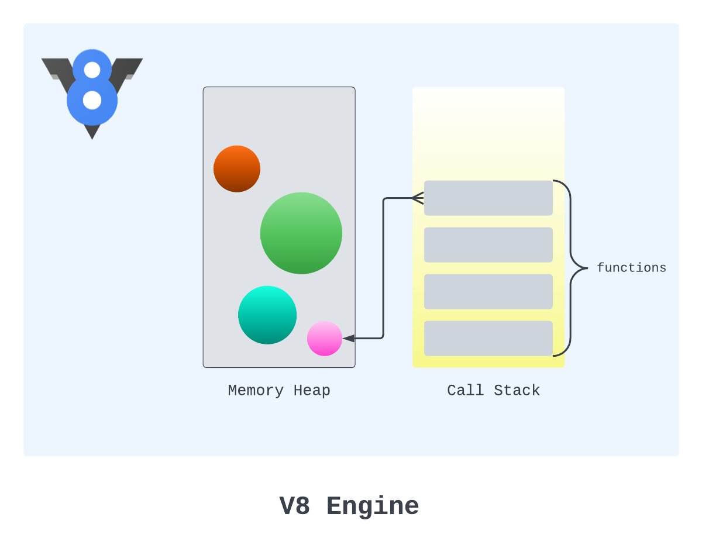
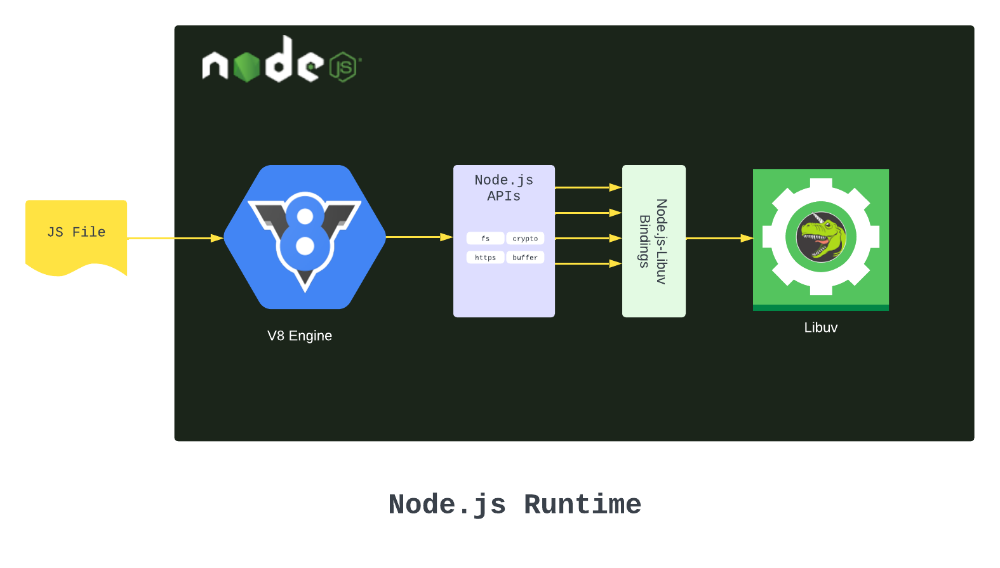
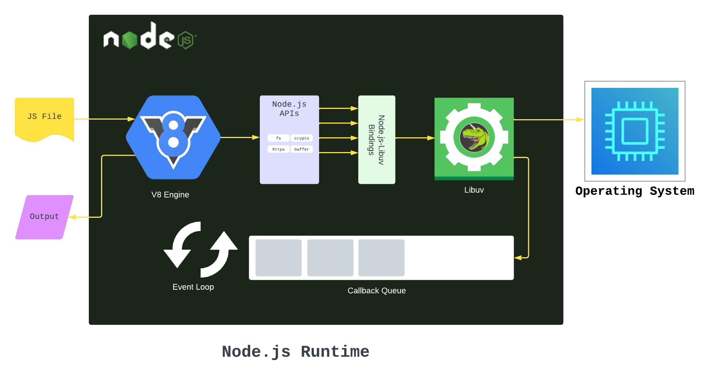
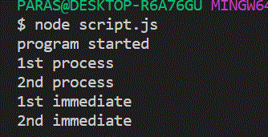

Node.js

*Q1. What is Node.js and how does it work?*

Node.js is an open-source, cross-platform JavaScript Runtime Environment. Node.js is a software program that can execute JavaScript code. Put more properly, Node.js is a JavaScript runtime environment. It is an environment developed to make it possible to use JavaScript code for server-side scripting.

How Does Node.js Work

Node.js was written mostly with C/C++. As a program that is supposed to run web servers, Node.js needs to constantly interact with a device's operating system. Building Node.js with a low-level language like C made it easy for the software to access the operating system’s resources and use them to execute instructions. There are three main components we must understand to see how Node.js works. These components are:

1. V8 Engine: 

The V8 Engine is the JavaScript engine that interprets and runs JavaScript code in the Chrome browser. Some other browsers use a different engine, for example, Firefox uses SpiderMonkey, and Safari uses JavaScriptCore. Without the JavaScript engine, a computer can not understand JavaScript. The V8 engine contains a memory heap and call stack. They are the building blocks for the V8 engine. They help manage the execution of JavaScript code. The memory heap is the data store of the V8 engine. Whenever we create a variable that holds an object or function in JavaScript, the engine saves that value in the memory heap. To keep things simple, it is similar to a backpack that stores supplies for a hiker.
Whenever the engine is executing code and comes across any of those variables, it looks up the actual value from the memory heap – just like whenever a hiker is feeling cold and wants to start a fire, they can look into their backpack for a lighter.

The call stack is another building block in the V8 engine. It is a data structure that manages the order of functions to be executed. Whenever the program invokes a function, the function is placed on the call stack and can only leave the stack when the engine has handled that function. JavaScript is a single-threaded language, which means that it can only execute one instruction at a time. Since the call stack contains the order of instructions to be executed, it means that the JavaScript engine has just one order, one call stack.

2. Libuv:

Libuv is a C library used for performing Input/output (I/O) operations. I/O operations have to do with sending requests to the computer and receiving responses. These operations include reading and writing files, making network requests, and so on. This means that Libuv is cross-platform (can run on any operating system) and has a focus on Asynchronous I/O. The computer tends to take time to process I/O instructions, It can handle more than one I/O operation at once. This is what makes Node.js process I/O instructions efficiently despite being single-threaded. Whenever we pass a script to Node.js, the engine parses the code and starts processing it. The call stack holds the invoked functions and keeps track of the program. If the V8 engine comes across an I/O operation, it passes that operation over to Libuv. Libuv then executes the I/O operation. There are bindings that connect JavaScript functions to their actual implementation in Libuv. These bindings make it possible to use JavaScript code for I/O instructions. Node.js uses Libuv for the actual implementation but exposes Application Programming Interfaces (APIs). So, we can now use a Node.js API (which looks like a JavaScript function) to initiate an I/O operation. One interesting thing to note is that it is true that JavaScript is a single-threaded language, but Libuv—the low-level library Node.js uses— can make use of a thread pool (multiple threads) when executing instructions in the operating system. 

3. Event Loop:

The Event Loop in Node.js is a very important part of the process. From the name, we can see it is a loop. The loop starts running as Node.js begins executing a program. When we run our JavaScript program that contains some asynchronous code (like I/O instructions or timer-based actions), Node.js handles them using the Node.js APIs. Asynchronous functions usually have instructions to be executed after the function has finished processing. Those instructions are placed in a Callback Queue. The Callback Queue works with the First In First Out (FIFO) approach. That means the first instruction (callback) to enter the queue is the first to be invoked. As the event loop runs, it checks if the call stack is empty. If the call stack is not empty, it allows the ongoing process to continue. But if the call stack is empty, it sends the first instruction on the callback queue to the JavaScript engine. The engine then places that instruction (function) on the call stack and executes it. So, the event loop executes callbacks from asynchronous instructions using the JavaScript V8 engine in Node.js. And it is a loop, which means every time it runs, it checks the call stack to know if it will remove the foremost callback and send it to the JavaScript engine. Node.js is said to have an event-driven architecture. This means Node.js is built around listening to events and reacting to them promptly when they happen. These events can be timer events, network events, and so on. Node.js responds to those events by using an event loop to load event callbacks to the engine after something triggers an event. It is for this reason that Node.js is excellent for real-time data transfer in applications.

*Q2. Explain the Node.js event-driven architecture.*

NodeJS uses an event-driven architecture, which is a key part of how it handles many tasks at once without blocking. This approach relies on events, event emitters, and listeners to manage asynchronous operations efficiently. It is a design pattern where applications respond to events—changes in state, user input, or messages from other programs. Instead of a program's logic being tied to a specific sequence of steps, it reacts to events as they occur.This makes applications more flexible and responsive.

Event-Driven Architecture Working
NodeJS is inherently event-driven. The main focus is on a single-threaded event loop, which efficiently manages asynchronous operations. Here's how it works

- Events: Things that happen in your application, like a user clicking a button, a file being read, or a network request completing, are represented as "events."

- Event Loop: NodeJS has a central "event loop" that constantly monitors these events. It's like a traffic controller for your application.

- Callbacks: When an event occurs, NodeJS executes a corresponding "callback" function.This function contains the code that should run in response to that specific event.

- Non-Blocking: The event loop is non-blocking. This means that while waiting for an event (like a file to finish reading), NodeJS can handle other tasks.This is what makes NodeJS so efficient at handling many things at once.

- Asynchronous Operations: Many operations in NodeJS are asynchronous. For example, reading a file doesn't stop the rest of your program. Instead, NodeJS registers a callback function to be executed when the file is read.

*Q3. What is the difference between process.nextTick() and setImmediate()?*

process.nextTick() runs code immediately after the current operation, before I/O tasks. setImmediate() schedules code to run after the current event loop phase, following I/O tasks, impacting execution timing.

- process.nextTick() method

Whenever a new queue of operations is initialized we can think of it as a new tick. The process.nextTick() method adds the callback function to the start of the next event queue. It is to be noted that, at the start of the program process.nextTick() method is called for the first time before the event loop is processed.

Syntax: process.nextTick(callback);

- setImmediate() method

Whenever we call setImmediate() method, it's callback function is placed in the check phase of the next event queue. There is slight detail to be noted here that setImmediate() method is called in the poll phase and it's callback functions are invoked in the check phase.

Syntax: setImmediate(callback);

Example: This example illustrates that process.nextTick() callbacks execute before setImmediate() callbacks, even though both are scheduled in the same event loop iteration.

setImmediate(function A() {
	console.log("1st immediate");
});

setImmediate(function B() {
	console.log("2nd immediate");
});

process.nextTick(function C() {
	console.log("1st process");
});

process.nextTick(function D() {
	console.log("2nd process");
});

// First event queue ends here
console.log("program started");

Explanation:

For the above program, event queues are initialized in the following manner:

- In the first event queue only 'program started is printed'.

- Then second event queue is started and function C i.e. callback of process.nextTick() method is placed at the start of the event queue. C is executed and the queue ends.

- Then previous event queue ends and third event queue is initialized with callback D. Then callback function A of setImmdeiate() method is placed in the followed by B. Now, the third event queue looks like this - D A B - Now functions D, A, B are executed in the order they are present in the queue.

