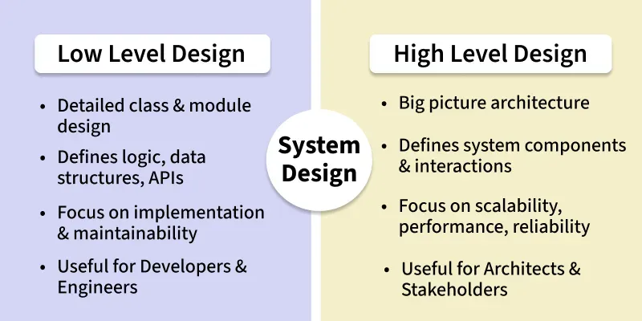
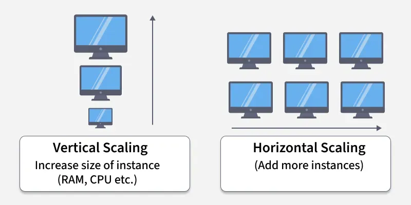
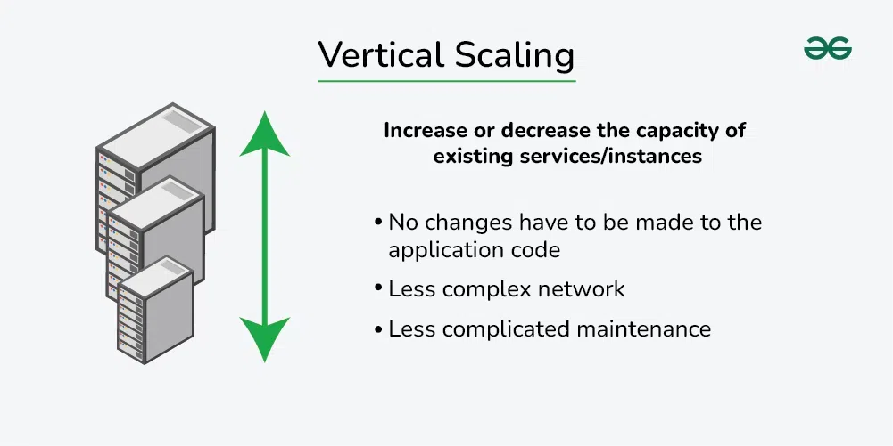
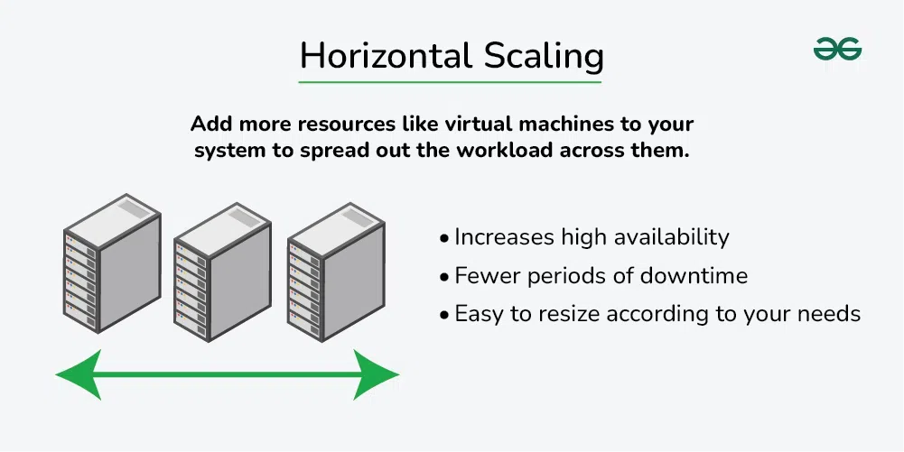

*Q1. What is system design?*

System design is the process of planning, structuring and defining the architecture of Software System.

- Involves translating user requirements into a detailed blueprint that guides the implementation phase.
- The goal is to create a well-organized and efficient structure that meets the intended purpose while considering factors like scalability, maintainability, and performance.

System Design in SDLC

- In System Design Life Cycle, without the designing phase, one cannot jump to the implementation or the testing part.
- System Design is a vital step and also provides the backbone to handle exceptional scenarios because it represents the business logic of the software.

System Design can be divided into two complementary parts

Real World Examples of HLD Decisions

- Netflix transitioned their entire backend from a monolith to microservices (starting with encoding and UI services), completing the migration by 2011 to scale rapidly during high-load events like holiday seasons.

- Uber adopted an event-driven architecture where ride requests, location updates, and fare changes emit events that trigger real-time systems like driver matching, billing, and dynamic pricing.

- Twitter deployed a load-balanced architecture with caching of trending topics and tweets to quickly serve millions of users and handle real-time data flows efficiently.

Steps for getting started with System Design

- Understand Requirements: Gather and analyze business needs by consulting stakeholders, users, and documentation.

- Define Architecture: Identify key system components and how they interact (e.g., services, APIs, databases).

- Choose Tech Stack: Select appropriate languages, databases, frameworks, and tools based on requirements.

- Design Modules: Break the system into modules, defining their responsibilities and data flow.

- Plan for Scalability: Design with growth in mind—anticipate load, optimize bottlenecks, and use scalable patterns.

*Q2. Horizontal vs. Vertical Scaling*

In system design, scaling is crucial for managing increased loads. Horizontal scaling and vertical scaling are two different approaches to scaling a system, both of which can be used to improve the performance and capacity of the system.

Why do we need Scaling!!

- Handle increased user load and traffic.
- Ensure high availability and reliability.
- Maintain performance and response time.
- Support growing data and storage needs.

Vertical Scaling

Vertical scaling, also known as scaling up, refers to the process of increasing the capacity or capabilities of an individual hardware or software component within a system.

- We upgrade the same system rather than adding more systems. Add more power to your machine by adding better processors, increasing RAM, or other power-increasing adjustments.
- Simple to implement and useful for monolithic and small scale applications.

Examples

- Upgrading a MySQL server from 16 GB RAM to 64 GB to handle more queries.
- Moving a website hosted on a 2-core VM to an 8-core, higher-RAM VM to improve performance.
- E-commerce platform running on a single large AWS EC2 instance with increased resources (CPU, RAM, disk).

Advantages

- Increased capacity: A server's performance and ability to manage incoming requests can both be enhanced by upgrading its hardware.
- Easier management: Upgrading a single node is usually the focus of vertical scaling, which might be simpler than maintaining several nodes.

Disadvantages

- Limited scalability: Vertical scaling is constrained by the hardware's physical limitations. Horizontal Scaling is not limited.
- One server still receives all incoming requests thus increasing the possibility of downtime in the event of a server failure.
- Scaling up often requires restarting or replacing the machine, causing downtime.

Horizontal Scaling

Horizontal scaling, also known as scaling out, refers to the process of increasing the capacity or performance of a system by adding more machines or servers to distribute the workload across a larger number of individual units.

- There is no need to change the capacity of the server or replace the server.
- There is no downtime while adding more servers to the network.

Examples

- A website like GeeksforGeeks adds more web servers behind a load balancer to handle traffic spikes.
- Netflix scales different microservices independently — e.g., multiple instances of the streaming service across regions.
- Amazon Auto Scaling spins up more EC2 instances during peak shopping hours (e.g., Black Friday).

Advantages

- Increased capacity: More nodes or instances can handle a larger number of incoming requests.
- Improved performance: By distributing the load over several nodes or instances, it is less likely that any one server will get overloaded.

Disadvantages

- Requires complex architecture (load balancers, distributed databases, etc.).
- Difficult to maintain strong consistency across distributed nodes. Requires synchronization, messaging, or replication between nodes.
- More machines = more networking, power, and maintenance.
- Needs orchestration tools (e.g., Kubernetes, Ansible) to manage many servers.
- Communication between nodes adds latency and complexity.

