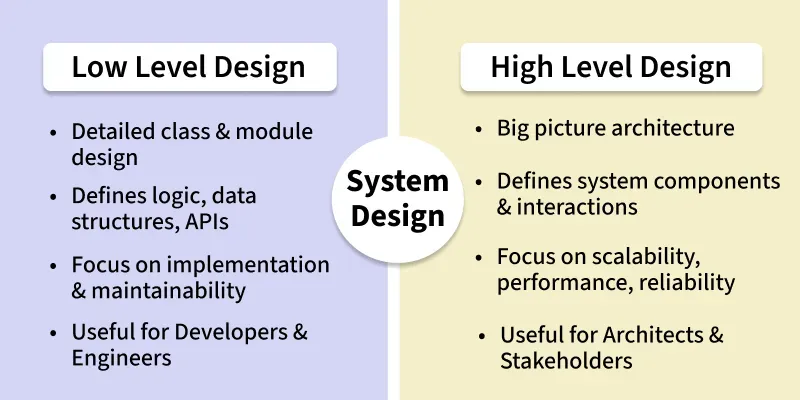
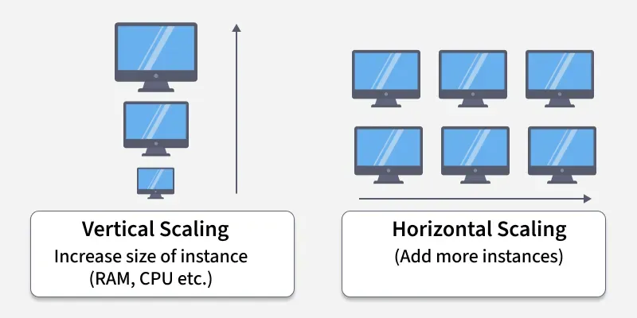
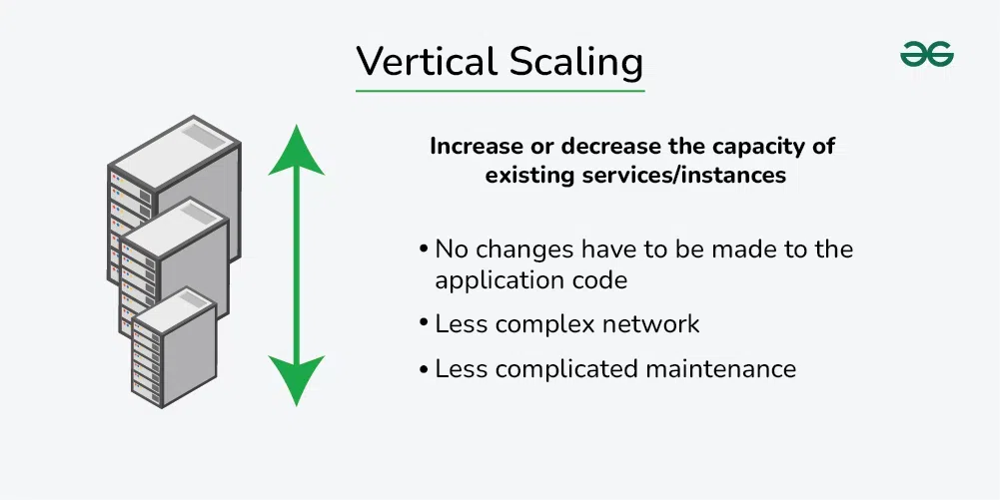
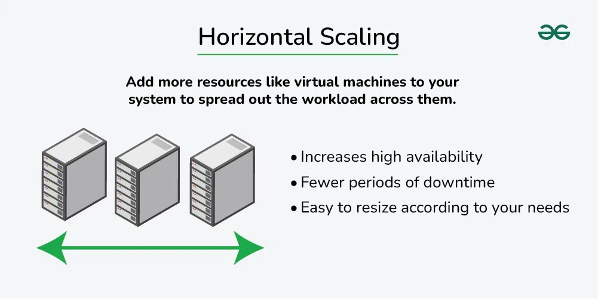
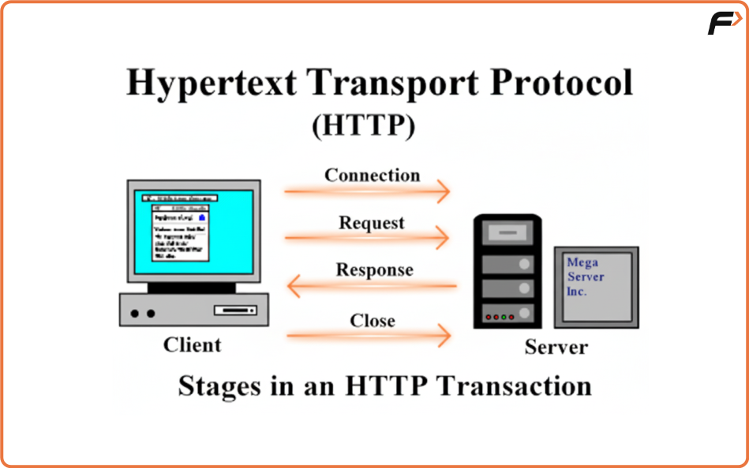
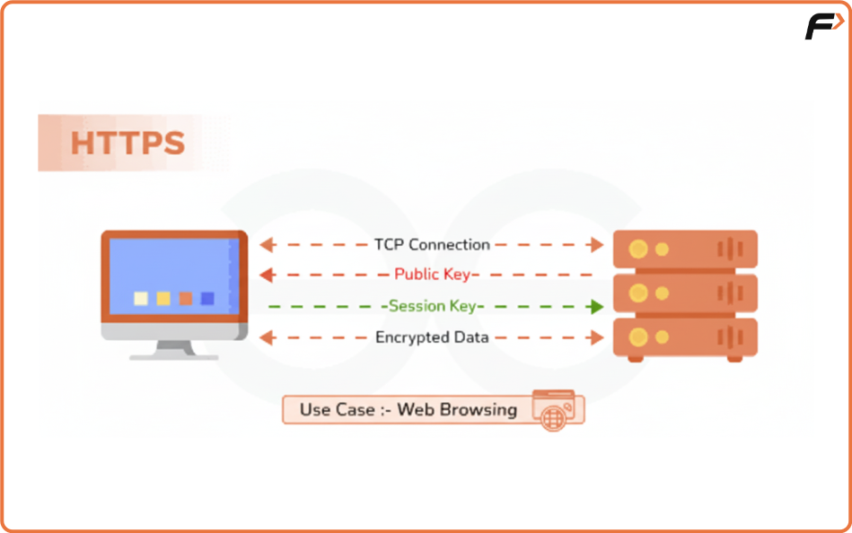
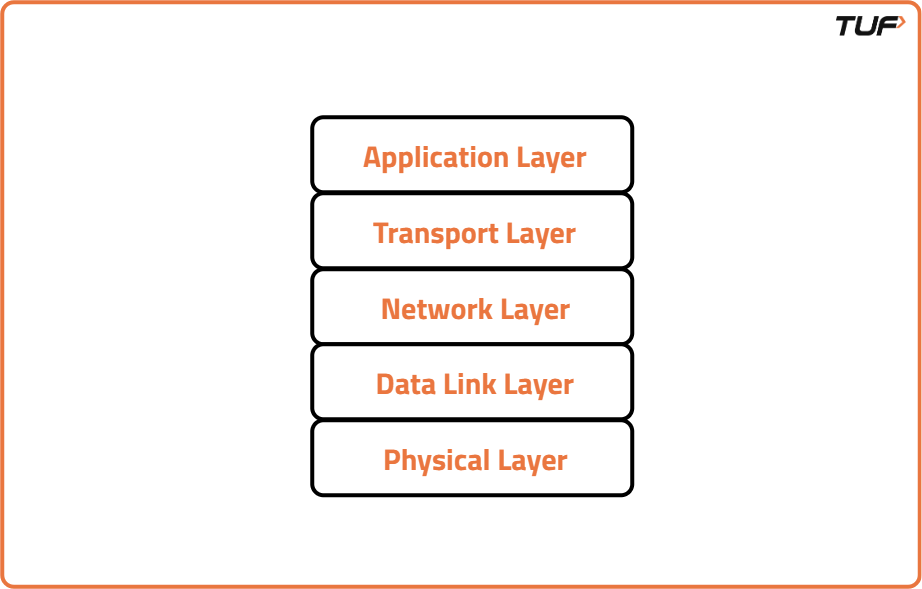
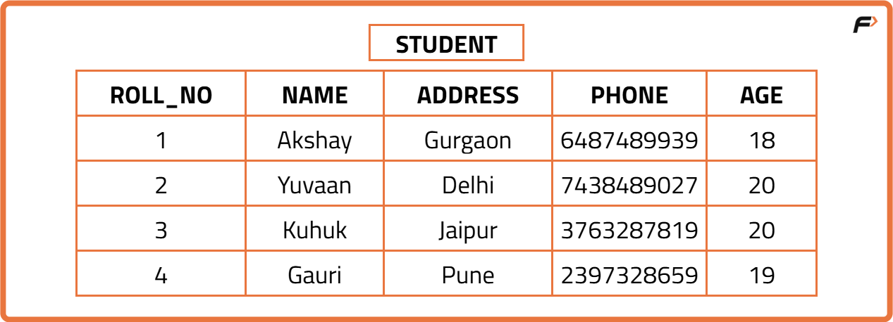

*Q1. What is system design?*

System design is the process of planning, structuring and defining the architecture of Software System.

- Involves translating user requirements into a detailed blueprint that guides the implementation phase.
- The goal is to create a well-organized and efficient structure that meets the intended purpose while considering factors like scalability, maintainability, and performance.

System Design in SDLC

- In System Design Life Cycle, without the designing phase, one cannot jump to the implementation or the testing part.
- System Design is a vital step and also provides the backbone to handle exceptional scenarios because it represents the business logic of the software.

System Design can be divided into two complementary parts

Real World Examples of HLD Decisions

- Netflix transitioned their entire backend from a monolith to microservices (starting with encoding and UI services), completing the migration by 2011 to scale rapidly during high-load events like holiday seasons.

- Uber adopted an event-driven architecture where ride requests, location updates, and fare changes emit events that trigger real-time systems like driver matching, billing, and dynamic pricing.

- Twitter deployed a load-balanced architecture with caching of trending topics and tweets to quickly serve millions of users and handle real-time data flows efficiently.

Steps for getting started with System Design

- Understand Requirements: Gather and analyze business needs by consulting stakeholders, users, and documentation.

- Define Architecture: Identify key system components and how they interact (e.g., services, APIs, databases).

- Choose Tech Stack: Select appropriate languages, databases, frameworks, and tools based on requirements.

- Design Modules: Break the system into modules, defining their responsibilities and data flow.

- Plan for Scalability: Design with growth in mind—anticipate load, optimize bottlenecks, and use scalable patterns.

*Q2. Horizontal vs. Vertical Scaling*

In system design, scaling is crucial for managing increased loads. Horizontal scaling and vertical scaling are two different approaches to scaling a system, both of which can be used to improve the performance and capacity of the system.

Why do we need Scaling!!

- Handle increased user load and traffic.
- Ensure high availability and reliability.
- Maintain performance and response time.
- Support growing data and storage needs.

Vertical Scaling

Vertical scaling, also known as scaling up, refers to the process of increasing the capacity or capabilities of an individual hardware or software component within a system.

- We upgrade the same system rather than adding more systems. Add more power to your machine by adding better processors, increasing RAM, or other power-increasing adjustments.
- Simple to implement and useful for monolithic and small scale applications.

Examples

- Upgrading a MySQL server from 16 GB RAM to 64 GB to handle more queries.
- Moving a website hosted on a 2-core VM to an 8-core, higher-RAM VM to improve performance.
- E-commerce platform running on a single large AWS EC2 instance with increased resources (CPU, RAM, disk).

Advantages

- Increased capacity: A server's performance and ability to manage incoming requests can both be enhanced by upgrading its hardware.
- Easier management: Upgrading a single node is usually the focus of vertical scaling, which might be simpler than maintaining several nodes.

Disadvantages

- Limited scalability: Vertical scaling is constrained by the hardware's physical limitations. Horizontal Scaling is not limited.
- One server still receives all incoming requests thus increasing the possibility of downtime in the event of a server failure.
- Scaling up often requires restarting or replacing the machine, causing downtime.

Horizontal Scaling

Horizontal scaling, also known as scaling out, refers to the process of increasing the capacity or performance of a system by adding more machines or servers to distribute the workload across a larger number of individual units.

- There is no need to change the capacity of the server or replace the server.
- There is no downtime while adding more servers to the network.

Examples

- A website like GeeksforGeeks adds more web servers behind a load balancer to handle traffic spikes.
- Netflix scales different microservices independently — e.g., multiple instances of the streaming service across regions.
- Amazon Auto Scaling spins up more EC2 instances during peak shopping hours (e.g., Black Friday).

Advantages

- Increased capacity: More nodes or instances can handle a larger number of incoming requests.
- Improved performance: By distributing the load over several nodes or instances, it is less likely that any one server will get overloaded.

Disadvantages

- Requires complex architecture (load balancers, distributed databases, etc.).
- Difficult to maintain strong consistency across distributed nodes. Requires synchronization, messaging, or replication between nodes.
- More machines = more networking, power, and maintenance.
- Needs orchestration tools (e.g., Kubernetes, Ansible) to manage many servers.
- Communication between nodes adds latency and complexity.

*Q3. What is Capacity Estimation?*

Capacity estimation in systems design is the process of predicting or determining the maximum load or demand that a system can handle within its operational parameters. This involves analyzing various aspects such as hardware capabilities, software performance, network bandwidth, and user behavior patterns.

- The goal is to ensure that the system can accommodate the expected workload without experiencing performance degradation, bottlenecks, or failures.
- Capacity estimation is crucial for designing and scaling systems effectively to meet current and future demands, whether it's a website, a network infrastructure, or any other complex system.

Factors that affect Capacity Estimation

- Hardware Resources: The capabilities of the hardware components such as processors, memory, storage devices, and network interfaces directly impact the system's capacity.

- Software Efficiency: The efficiency of the software algorithms, data structures, and overall design significantly affects how efficiently the system utilizes hardware resources.

- Workload Characteristics: Understanding the nature of the workload, including its intensity, variability, and peak periods, is essential for accurately estimating capacity requirements.

- User Behavior: User behavior patterns, such as browsing habits, transaction volumes, and concurrency levels, influence the system's capacity needs.

- Scalability: The system's ability to scale, both vertically (adding more resources to a single node) and horizontally (adding more nodes to a distributed system), impacts its overall capacity.

- Performance Metrics: Defining relevant performance metrics such as response time, throughput, and resource utilization helps in quantifying the system's capacity requirements.

- Failure Scenarios: Considering potential failure scenarios, such as hardware failures or network outages, is crucial for designing systems with adequate capacity for fault tolerance and resilience.

Tools and Resources for Capacity Estimation

- LoadRunner: LoadRunner is a performance testing tool used to simulate real-world user activity on your application. It creates virtual users to mimic actual users accessing your app. It measures how your system performs under different loads (light, normal, or heavy traffic) and identifies bottlenecks like slow responses, server crashes, or resource overuse.

- Grafana: Grafana is a data visualization and monitoring tool used to display real-time performance metrics of your system. Connects to data sources like databases, servers, or monitoring tools. Shows system metrics like CPU usage, memory usage, error rates, and traffic load on interactive dashboards and sends alerts when specific thresholds are crossed.

- Load Testing Tools: Tools like Apache JMeter, LoadRunner, and Gatling facilitate load testing to simulate real-world usage scenarios and measure system performance under various loads.

- Monitoring Platforms: Monitoring tools such as Prometheus, Nagios, and Datadog provide real-time insights into system performance metrics, resource utilization, and capacity trends.

*Q4. What is HTTP?*

When you browse the internet, every website you visit communicates with your device using a protocol. Two of the most common ones are HTTP (Hypertext Transfer Protocol) and HTTPS (Hypertext Transfer Protocol Secure). Think of HTTP as a regular postal service delivering letters without an envelope. Anyone along the way can read them. HTTPS, on the other hand, is like sending those same letters sealed inside a locked envelope. Only the sender and receiver can understand the contents. This difference makes HTTPS the modern standard, especially when dealing with sensitive information like passwords, online payments, and personal data.

HTTP

HTTP stands for HyperText Transfer Protocol. It is the standard protocol used by web browsers and servers to communicate and exchange data.Think of HTTP like sending a postcard. Anyone who handles the postcard during delivery (like routers, ISPs, or hackers on the network) can read what’s written on it because it’s all in plain text.

- HTTP operates on port 80 by default.
- It transfers data in plain text, meaning the content is not protected.
- Because it is unencrypted, attackers can intercept or modify the data easily.
- It is still used for non-sensitive websites where security is not a concern (like public blogs or info pages).

Advantages of HTTP

- Simplicity: Easy to implement and use since it does not require complex encryption mechanisms.
- Speed (without encryption): Faster in small setups because no encryption or decryption is performed.
- Compatibility: Supported by all browsers, servers, and applications without extra configuration.

Disadvantages of HTTP

- No Security: Data is sent in plain text and can be intercepted by attackers.
- No User Trust: Browsers often label HTTP websites as “Not Secure.”
- Not Suitable for Sensitive Data: Cannot be used for banking, login systems, or e-commerce where private information is exchanged.

What is HTTPS?

HTTPS stands for HyperText Transfer Protocol Secure. It is an extension of HTTP with added security through encryption. If HTTP is a postcard, HTTPS is like a locked envelope. Anyone can send it, but only the person with the right key (the website’s server) can open and read it. Even if attackers intercept it, they only see scrambled content.

- HTTPS operates on port 443 by default.
- It uses SSL (Secure Sockets Layer) or TLS (Transport Layer Security) to encrypt the data.
- Even if attackers capture the traffic, they cannot read the actual message.
- Browsers show a padlock symbol next to the URL to indicate that the site is secure.

Advantages of HTTPS

- Data Encryption: Protects information using SSL/TLS, making it unreadable to attackers.
- User Trust: Shows a padlock icon, increasing visitor confidence.
- SEO Benefits: Preferred by search engines and ranked higher compared to HTTP sites.
- Prevents Data Tampering: Stops man-in-the-middle attacks and ensures integrity of information.
- Supports Modern Protocols: HTTPS enables HTTP/2 and faster performance with multiplexing and compression.

Disadvantages of HTTPS

- Cost of Certificates: Requires SSL/TLS certificates (though many providers now offer them free via Let’s Encrypt).
- Performance Overhead: Encryption and decryption add slight computational overhead, though minimized in modern systems.
- Setup Complexity: Requires configuration of certificates, renewals, and proper server setup.

*Q5. What is the Internet TCP/IP stack?*

Explain TCP model

Transmission Control Protocol/Internet Protocol(TCP/IP) is a practical network model developed by the Department of Defense (DoD) in the 1960s to support communication between different network devices on the internet. 

TCP is a set of communication protocols that supports network communication.

The TCP model is subdivided into five layers, each containing specific protocols.

Layers of TCP model

1. Physical Layer

- The physical layer translates message bits into signals for transmission on a medium, i.e. the physical layer is the place where the real communication takes place.
- Signals are generated depending on the type of media used to connect two devices. For example, electrical signals are generated for copper cables, light signals are generated for optical fibers, and radio waves are generated for air or vacuum.
- Physical layer also specifies characteristics like topology(bus,star,hybrid,mesh,ring), line configuration(point-to-point, multipoint) and transmission mode(simplex, half-duplex, full-duplex).

2. Data Link Layer(DLL)

- The DLL is subdivided into 2 layers: MAC(Media Access Control), LLC(Logical Link Control)
- The MAC layer is responsible for data encapsulation(Framing) of IP packets from the network layer into frames. Framing means DLL adds a header(which contains the MAC address of source and destination) and a trailer(which contains error-checking data) at the beginning and end of IP packets.
- LLC deals with flow control and error control. Flow control: Limits how much data a sender can transfer without overwhelming the receiver. Error Control: Error in the data transmission can be detected by checking the error detection bits in the trailer of the frame.

3. Network Layer

The network layer adds IP address/logical address to the data segments to form IP packets and finds the best possible path for data delivery. IP addresses are addresses allocated to a device to uniquely identify it on a global scale. Common protocols used in the Network layer are

- IP(Internet Protocol): IP uses the receiver’s IP address to determine the best path for the proper delivery of packets to the destination. When a packet is too large to send over a network medium, the sender host's IP splits it up into smaller fragments. The fragments are reassembled into the original packet on the receiving host. IP is unreliable since it does not ensure delivery or check for errors.
- ARP(Address Resolution Protocol): ARP is used to find MAC/physical Addresses from the IP address.
- ICMP(Internet Control Message Protocol): ICMP is responsible for error reporting.

4. Transport Layer 

The transport layer is in charge of flow control (controlling the rate at which data is transferred), end-to-end connectivity, and error-free data transmission. Protocols used in the Transport layer:

- TCP(Transmission Control Protocol): 
- TCP is a connection-oriented protocol, which means it requires the formation and termination of connections between devices in order to transmit data.
- TCP segmentation means that at the sending node, TCP breaks the entire message into segments, assigns a sequence number to each segment, then reassembles the segments into the original message at the receiving end based on the sequence numbers.
- TCP is a reliable protocol because it identifies errors and retransmits the damaged frames, and ensures data delivery in the correct order.
- UDP(User Datagram Protocol):
- UDP is a connectionless protocol, which means it does not require the establishment and termination of connections between devices.
- UDP does not support segmentation and lacks error checking and correction which makes it less reliable but more cost-efficient.

5. Application Layer

This is the uppermost layer, which combines the OSI model's session, presentation, and application layers. Users can interact with the application and access network resources through this layer.

Protocols used in the Application layer:

- HTTP(Hypertext Transfer Protocol): Protocol used to access data on the World Wide Web.
- DNS(Domain Name System): This protocol translates domain names to IP addresses.
- SMTP(Simple Mail Transfer Protocol): This protocol is used to send Email messages.
- FTP(File Transfer Protocol): This protocol is used to transfer files between computers.
- TELNET(Telecommunication Network): It is a two-way communication protocol connecting a local machine to a remote machine.

*Q6. What happens when you enter Google.com?*

- So the first thing that happens is that your browser looks up in its cache to see if that website was visited before and the IP address is known.

- If it can't find the IP address for the URL requested then it asks your operating system to locate the website. The first place your operating system is going to check for the address of the URL you specified is in the host file. If the URL is not found inside this file, then the OS will make a DNS request to find the IP Address of the web page.

- The first step is to ask the Resolver (or Internet Service Provider) server to look up its cache to see if it knows the IP Address, if the Resolver does not know then it asks the root server to ask the .COM TLD (Top Level Domain) server - if your URL ends in .net then the TLD server would be .NET and so on - the TLD server will again check in its cache to see if the requested IP Address is there. 

- If not, then it will have at least one of the authoritative name servers associated with that URL, and after going to the Name Server, it will return the IP Address associated with your URL. All this was done in a matter of milliseconds WOW!

- After the OS has the IP Address and gives it to the browser, it then makes a GET (a type of HTTP Method) to said IP Address. When the request is made the browser again makes the request to the OS which then, in turn, packs the request in the TCP traffic protocol we discussed earlier, and it is sent to the IP Address. 

- On its way, it is checked by both the OS' and the server's firewall to make sure that there are no security violations. And upon receiving the request the server (usually a load balancer that directs traffic to all available servers for that website) sends a response with the IP Address of the chosen server along with the SSL (Secure Sockets Layer) certificate to initiate a secure session (HTTPS). 

- Finally, the chosen server then sends the HTML, CSS, and Javascript files (If any) back to the OS who in turn gives it to the browser to interpret it. And then you get your website as you know it.

*Q7. What are Relational Databases?*

The relational model in a Database Management System (DBMS) is a framework for managing and organizing data using tables, also known as relations. After designing the conceptual model of the Database using ER diagrams, we need to convert the conceptual model into a relational model that can be implemented using any RDBMS language like Oracle SQL, MySQL, etc.

It was introduced by Edgar F. Codd in 1970 and has become the foundation for most modern database systems. The relational model emphasizes the use of a structured, tabular format to store data and the relationships between those data points.

Key Terminologies

- Tables (Relations): Data is stored in tables, which consist of rows and columns. Each table represents a specific entity or concept.
- Rows (Tuples): Each row in a table represents a single record or instance of the entity described by the table.
- Columns (Attributes): Each column in a table represents a specific attribute or property of the entity. All values in a column are of the same data type.
- Degree: The number of attributes in the relation is known as the degree of the relation.
- Cardinality: The number of tuples in a relation is known as cardinality.

Let’s take an example of a student table for a class. We would call it the STUDENT relation. The relation STUDENT would have attributes ROLL_NO, NAME, ADDRESS, PHONE, and AGE, which would be represented as columns, and each student would be a record or tuple represented by each row of the table.

Integrity

Data integrity is an important aspect of relational models. Integrity should be maintained and checked for before performing any operation (insertion, deletion, and updation) in the database. If there is a violation of any of the constraints, the operation will fail.

Maintaining integrity constraints involves:

- Domain Integrity: Ensuring that all values in a column are of a specific data type.
- Entity Integrity: Each row must be unique, where keys come into the picture (candidate, super, primary, etc.).
- Referential Integrity: Ensuring that foreign keys correctly reference primary keys in other tables.

The values must be atomic, i.e., they can’t be divided further. For example, instead of having a NAME attribute, have separate attribute columns for FIRST_NAME, MIDDLE_NAME, and LAST_NAME.

*Q8. What are Database Indexes?*

In simple terminology, an index maps search keys to corresponding data on disk by using different in-memory & on-disk data structures. Index is used to quicken the search by reducing the number of records to search for.

Mostly an index is created on the columns specified in the WHERE clause of a query as the database retrieves & filters data from the tables based on those columns. If you don’t create an index, the database scans all the rows, filters out the matching rows & returns the result. With millions of records, this scan operation may take many seconds & this high response time makes APIs & applications slower & unusable.

Primary Key:
Take the following into consideration when creating a primary key:

- A primary key should be part of many vital queries in your application.
- Primary key is a constraint that uniquely identifies each row in a table. If multiple columns are part of the primary key, that combination should be unique for each row.
- Primary key should be Non-null. Never make null-able fields your primary key. By ANSI SQL standards, primary keys should be comparable to each other, and you should definitely be able to tell whether the primary key column value for a particular row is greater, smaller or equal to the same from other row. Since NULL means an undefined value in SQL standards, you can’t deterministically compare NULL with any other value, so logically NULL is not allowed.
- The ideal primary key type should be a number like INT or BIGINT because integer comparisons are faster, so traversing through the index will be very fast.

What is the difference between key & index

Although the terms key & index are used interchangeably, key means a constraint imposed on the behaviour of the column. In this case, the constraint is that primary key is non null-able field which uniquely identifies each row. On the other hand, index is a special data structure that facilitates data search across the table.

*Q9. What are NoSQL databases?*

